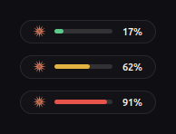
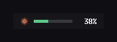

# Claude Context Bar

A minimal always-on-top overlay that shows how much **context window** you have
used in your running [Claude Code](https://claude.com/claude-code) session — by
session name, not just by folder. Runs on Linux, macOS and Windows.

<p align="center">
  
</p>

<p align="center"><sub>Shown at actual size — 150&times;26&nbsp;px.</sub></p>

It sits at the top-centre of the screen, refreshes every few seconds, and turns
amber then red as the window fills up. The track and the number both show how
much context is **used**, counting upward, so they agree with what `/context`
reports inside Claude Code. Hover for the session name, or click to switch
sessions.

## Why

`/context` tells you where you stand only when you stop and ask. This keeps the
number in view while you work, so a compaction never takes you by surprise.

## Features

- **Named sessions.** Shows the name you gave a session — *"RAPTOR WIFI (Main)"* —
  not `-home-user-project`. A name you set yourself always beats the
  auto-generated one, which often describes only the session's first minute.
- **Small on purpose.** 150×26 px. It reports a number, it does not narrate.
- **Session picker.** Click the bar to switch between recent sessions, or leave
  it on **Auto** to follow whichever one you are using right now.
- **Show / hide.** `Super+Shift+C` from anywhere, a menu item, or the CLI.
- **Colour-coded headroom.** Green below 50 % used, amber beyond, red past 80 %.
- **Multi-window aware.** Detects both the 200 k and 1 M context windows.
- **Reads numbers only.** It extracts token counts, the session id, its title
  and its working directory, and nothing else. Message content is never parsed,
  stored or transmitted, and it makes no network calls of any kind — see
  [Security and privacy](#security-and-privacy).

## Platform support

Python 3.8+ is the only hard requirement. The gauge draws through one of two
toolkits, picked automatically.

| Platform | Toolkit | Status |
| --- | --- | --- |
| Linux (GNOME/Wayland, X11) | GTK 3, falls back to Tk | **Tested** — developed on Ubuntu 24.04 / GNOME 46 / Wayland |
| macOS | Tk | Tk backend verified running; macOS integration untested |
| Windows | Tk | Tk backend verified running; Windows integration untested |

Both backends have been run for real and captured:

<p align="center">
  
  &nbsp;&nbsp;
  
</p>
<p align="center"><sub>GTK on the left, Tk on the right — both at actual size.</sub></p>

The Tk backend was exercised on Linux against a real Tk 9.0. What remains
unverified on macOS and Windows is the platform integration around it: window
stacking for a borderless always-on-top window, the LaunchAgent and Startup
entries, and the desktop launchers. I own neither machine, so bug reports are
very welcome.

Tk draws a square-cornered pill rather than the rounded one, deliberately: Tk
cannot antialias canvas polygons, so a drawn rounded corner comes out visibly
stair-stepped. For the same reason the mark is a pre-rendered PNG there instead
of drawn geometry.

Force a toolkit with `--backend gtk` or `--backend tk`.

### Getting a toolkit

| Platform | Command |
| --- | --- |
| Debian / Ubuntu | `sudo apt install python3-gi gir1.2-gtk-3.0 librsvg2-common` |
| Fedora | `sudo dnf install python3-gobject gtk3 librsvg2` |
| Arch | `sudo pacman -S python-gobject gtk3 librsvg` |
| Any Linux, Tk instead | `sudo apt install python3-tk` |
| macOS | Tk ships with the [python.org](https://python.org) build; with Homebrew, `brew install python-tk` |
| Windows | Tk ships with the python.org installer (the Microsoft Store build may omit it) |

## Install

```bash
git clone https://github.com/CashMahmood/claude-context-bar.git
cd claude-context-bar
```

**Linux** — the better-tested path:

```bash
./install.sh
```

**macOS and Windows**:

```bash
python3 install.py          # python install.py on Windows
```

Both accept `--no-autostart`, `--no-hotkey`, `--no-desktop-icon` and
`--no-start`. `install.py --uninstall` reverses it.

Everything lands under your home directory — no root, no system files:

| Path | What |
| --- | --- |
| `~/.local/bin/claude-context-bar` | the overlay |
| `~/.local/bin/claude-context-probe` | the reader that produces the numbers |
| `~/.local/share/claude-context-bar/logo.svg` | the mark |
| `~/.local/share/applications/` | app-menu launcher |
| `~/.config/autostart/` | starts at login |
| `~/.config/claude-context-bar.json` | which session you pinned |

Installer flags: `--no-autostart`, `--no-hotkey`, `--no-desktop-icon`.

## Usage

Click the bar to open the menu. Everything is also available from the CLI:

| Command | Effect |
| --- | --- |
| `claude-context-bar` | start it (or reveal the running one) |
| `claude-context-bar --toggle` | show / hide — this is what the hotkey calls |
| `claude-context-bar --show` / `--hide` | force one or the other |
| `claude-context-bar --status` | running? visible? |
| `claude-context-bar --quit` | stop it |
| `claude-context-bar --backend gtk\|tk` | force a toolkit |
| `claude-context-bar --install-hotkey` | bind `Super+Shift+C` (GNOME only) |
| `claude-context-bar --remove-hotkey` | unbind it |

The global hotkey is GNOME-only. On macOS bind
`claude-context-bar --toggle` through Shortcuts or Automator; on Windows, set a
shortcut key on the desktop launcher.

The reader works standalone, and prints JSON:

```bash
claude-context-probe              # the newest session
claude-context-probe --list       # every recent session
claude-context-probe --session ID # one specific session
```

```json
{"id": "6e843c67-…", "title": "Context usage progress bar overlay",
 "project": "/home/you/work", "used": 173036, "limit": 1000000,
 "pct_used": 17.3, "pct_left": 82.7, "model": "claude-opus-5",
 "age_s": 2, "ok": true}
```

That makes it easy to reuse elsewhere — a tmux status line, Waybar, Polybar,
i3blocks, or a shell prompt.

## Configuration

Set these in the environment before launching:

| Variable | Default | Meaning |
| --- | --- | --- |
| `CLAUDE_BAR_W` | `150` | width in pixels |
| `CLAUDE_BAR_H` | `26` | height in pixels |
| `CLAUDE_BAR_Y` | `38` | distance from the top edge |
| `CLAUDE_BAR_INTERVAL` | `4` | refresh seconds |
| `CLAUDE_BAR_CLICKTHROUGH` | unset | `1` makes clicks pass through — the menu stops working, so drive it by hotkey |
| `CLAUDE_CTX_LIMIT` | auto | force the window size, e.g. `200000` |

## How it works

Claude Code appends a JSON Lines transcript per session under
`~/.claude/projects/<encoded-path>/<session-id>.jsonl`. The reader:

1. picks the most recently modified transcript (or the one you pinned);
2. scans backwards for the last `usage` object and adds up `input_tokens`,
   `cache_read_input_tokens` and `cache_creation_input_tokens` — the last
   assistant turn's prompt *is* the live context. The reply's `output_tokens`
   are deliberately excluded, so the figure tracks `/context` rather than
   running slightly ahead of it;
3. takes the project from `cwd`, and the session name from whichever source
   wins: a name **you** set is stored outside the transcript, in
   `~/.claude/jobs/<id>/state.json` as `name` with `nameSource: "user"` (or
   `customTitle`), and takes priority over the `aiTitle` record that Claude
   Code generates. That directory is named with only the first eight
   characters of the session id, so the lookup keys off the ids inside the
   file — `resumeSessionId` included, because resuming a session starts a new
   transcript while the job keeps its name.

The context window is read from `~/.claude/settings.json`, because the
transcript records the bare model id (`claude-opus-5`) while only the settings
file keeps the `[1m]` suffix that separates the 1 M window from the 200 k one.
If the measured usage exceeds the assumed limit, it corrects itself upward.

## Security and privacy

It runs entirely on your machine as your own user.

- **No network access.** There is no HTTP client, no socket, no telemetry. The
  only thing it executes is `gsettings`, to register the keyboard shortcut.
- **No shell.** Every subprocess call passes an argument list, never a shell
  string, so nothing is interpolated into a command line.
- **Your transcripts stay shut.** The reader pulls four values out of a
  session file — token counts, session id, title and working directory. It
  never parses or emits message content.
- **Signals only its own processes.** `/proc` exposes every user's processes,
  so instance discovery checks the owning uid before signalling anything.
- **Private state.** The pinned-session file and the visibility flag are
  written `0600`.
- **Launchers are pinned to an absolute path**, so nothing earlier on `PATH`
  can shadow the binary.
- **Your keybindings are left alone.** Installing reuses its own slot instead
  of appending duplicates, uninstalling removes only its own, and it refuses to
  rewrite the list at all if it finds an entry it does not recognise.
- **No root, ever.** Neither script uses `sudo`, and everything installs under
  your home directory.

## Known limitations

- **It cannot cover the GNOME top bar.** A Wayland compositor gives a normal
  client no say in its position or stacking, so the overlay runs through
  XWayland, where both work — but GNOME Shell draws its own panel above every
  window. The bar therefore sits just *below* the panel. Covering the panel
  would require a GNOME Shell extension.
- **The window size is inferred**, not reported. If you switch a single session
  to a different model mid-flight, set `CLAUDE_CTX_LIMIT`.
- **The percentage is of the raw context window.** Claude Code reserves an
  auto-compact buffer (33 k on a 1 M window) that it reports separately, so
  compaction begins slightly before the bar reads 100 %.

## Uninstall

```bash
./uninstall.sh
```

Removes every file, the autostart entry and the keyboard shortcut, leaving any
other custom shortcuts you have alone.

## Development

There is no build step — both commands are single-file Python scripts. Edit
them in place and re-run `./install.sh`.

The image at the top of this file is rendered from the real widgets rather than
mocked up, so it cannot drift away from the actual design:

```bash
python3 docs/render-preview.py
```

The Tk backend has a smoke test that runs it against a stubbed toolkit, so the
whole code path — geometry, refresh cycle, command pump, menu, tooltip — is
exercised on a machine with neither Tk nor a display:

```bash
python3 tests/smoke_tk.py
```

It proves the code runs without a display. To see it, run it against a real Tk
(`--backend tk`); that is how `docs/preview-tk.png` was captured.

## Contributing

Issues and pull requests are welcome. Useful directions: a GNOME Shell
extension build so it can sit in the panel proper, wlroots support via
`gtk-layer-shell`, and status-line adapters.

## Licence

MIT — see [LICENSE](LICENSE). Use it, fork it, ship it.

---

Not affiliated with, endorsed by, or sponsored by Anthropic. *Claude* is a
trademark of Anthropic, PBC. The starburst in `share/logo.svg` is an original
glyph drawn for this project.
