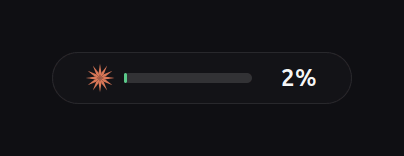

# Claude Context Bar

A minimal always-on-top overlay that shows how much **context window** you have
used in your running [Claude Code](https://claude.com/claude-code) session — by
session name, not just by folder. Linux, macOS and Windows.

<p align="center">
  
</p>

It sits at the top-centre of the screen, refreshes every few seconds, and turns
amber then red as the window fills up. Hover for the session name; click to
switch sessions.

## Why

`/context` tells you where you stand only when you stop and ask. This keeps the
number in view while you work, so a compaction never takes you by surprise.

## Contents

- [Features](#features) · [Platform support](#platform-support) · [Install](#install)
- [Usage](#usage) · [Configuration](#configuration) · [How it works](#how-it-works)
- [Privacy](#privacy) · [Troubleshooting](#troubleshooting) · [Development](#development)
- [Limitations](#known-limitations) · [Uninstall](#uninstall) · [Licence](#licence)

## Features

- **Named sessions.** Shows the name you gave a session — *"RAPTOR WIFI (Main)"* —
  not `-home-user-project`. A name you set yourself always beats the
  auto-generated one, which often describes only the session's first minute.
- **Session picker.** Click the bar to switch between recent sessions, or leave
  it on **Auto** to follow whichever one you are using right now.
- **Agrees with `/context`.** The track and the number both count *usage*
  upward, matching what Claude Code reports internally.
- **Show / hide.** `Super+Shift+C`, a menu item, a desktop launcher, or the CLI.
- **Colour-coded.** Green below 50 % used, amber beyond, red past 80 %.
- **Both context windows.** Detects 200 k and 1 M automatically.
- **Small.** Two standard-library Python files, no dependencies to install.

## Platform support

Python 3.8+ is the only hard requirement. The gauge draws through one of two
toolkits, chosen automatically and overridable with `--backend gtk|tk`.

| Platform | Toolkit | Status |
| --- | --- | --- |
| Linux (Wayland or X11) | GTK 3, falls back to Tk | **Tested** — developed on Ubuntu 24.04 / GNOME 46 / Wayland |
| macOS | Tk | Backend verified running; macOS integration untested |
| Windows | Tk | Backend verified running; Windows integration untested |

<p align="center">
  
  &nbsp;&nbsp;&nbsp;
  
</p>
<p align="center"><sub>GTK (Linux) on the left, Tk (macOS/Windows) on the right — both at actual size, 150&times;26&nbsp;px.</sub></p>

Both backends have been run and captured. What remains
unverified on macOS and Windows is the platform integration around them: window
stacking for a borderless always-on-top window, the LaunchAgent and Startup
entries, and the desktop launchers. I own neither machine, so reports from
either are very welcome — please open an issue.

### Getting a toolkit

| Platform | Command |
| --- | --- |
| Debian / Ubuntu | `sudo apt install python3-gi gir1.2-gtk-3.0 librsvg2-common` |
| Fedora | `sudo dnf install python3-gobject gtk3 librsvg2` |
| Arch | `sudo pacman -S python-gobject gtk3 librsvg` |
| Any Linux, Tk instead | `sudo apt install python3-tk` |
| macOS | Tk ships with the [python.org](https://python.org) build; with Homebrew, `brew install python-tk` |
| Windows | Tk ships with the python.org installer (the Microsoft Store build may omit it) |

## Install

```bash
git clone https://github.com/CashMahmood/claude-context-bar.git
cd claude-context-bar
```

**Linux** — the better-tested path:

```bash
./install.sh
```

**macOS and Windows**:

```bash
python3 install.py        # python install.py on Windows
```

Both accept `--no-autostart`, `--no-hotkey`, `--no-desktop-icon` and
`--no-start`. Nothing needs root; everything lands under your home directory.

| Path | What |
| --- | --- |
| `~/.local/bin/` (Linux, macOS)<br>`%LOCALAPPDATA%\claude-context-bar\bin\` (Windows) | the overlay and the reader |
| `~/.local/share/claude-context-bar/` | the mark, as SVG and PNG |
| `~/.local/share/applications/` | app-menu launcher (Linux) |
| `~/.config/autostart/` · `~/Library/LaunchAgents/` · Startup folder | starts at login |
| `~/.config/claude-context-bar.json`<br>`~/Library/Application Support/…`<br>`%APPDATA%\…` | which session you pinned |

## Usage

Click the bar for the menu. Everything is also on the CLI:

| Command | Effect |
| --- | --- |
| `claude-context-bar` | start it, or reveal the one already running |
| `claude-context-bar --toggle` | show / hide — what the hotkey calls |
| `claude-context-bar --show` / `--hide` | force one or the other |
| `claude-context-bar --status` | running? visible? |
| `claude-context-bar --quit` | stop it |
| `claude-context-bar --backend gtk\|tk` | force a toolkit |
| `claude-context-bar --install-hotkey` | bind `Super+Shift+C` (GNOME only) |
| `claude-context-bar --remove-hotkey` | unbind it |

The global hotkey is GNOME-only. On macOS, bind `claude-context-bar --toggle`
through Shortcuts or Automator; on Windows, set a shortcut key on the desktop
launcher's properties.

### The reader on its own

`claude-context-probe` works standalone and prints JSON, so you can feed a tmux
status line, Waybar, Polybar, i3blocks or a shell prompt:

```bash
claude-context-probe               # the newest session
claude-context-probe --list        # every recent session
claude-context-probe --session ID  # one specific session
```

```json
{"id": "6e843c67-…", "title": "RAPTOR WIFI (Main)", "title_source": "user",
 "project": "/home/you/work", "used": 173036, "limit": 1000000,
 "pct_used": 17.3, "pct_left": 82.7, "model": "claude-opus-5",
 "age_s": 2, "ok": true}
```

`title_source` is `user` if you named the session yourself, `ai` if Claude Code
generated the name.

## Configuration

Set these in the environment before launching:

| Variable | Default | Meaning |
| --- | --- | --- |
| `CLAUDE_BAR_W` | `150` | width in pixels |
| `CLAUDE_BAR_H` | `26` | height in pixels |
| `CLAUDE_BAR_Y` | `38` | distance from the top edge |
| `CLAUDE_BAR_X` | auto | force the horizontal position; useful on multi-monitor setups, where Tk sees one wide desktop and centres on the seam |
| `CLAUDE_BAR_INTERVAL` | `4` | refresh seconds |
| `CLAUDE_BAR_CLICKTHROUGH` | unset | `1` lets clicks pass through (GTK only; the menu stops working, so drive it by hotkey) |
| `CLAUDE_CTX_LIMIT` | auto | force the window size, e.g. `200000` |

## How it works

Claude Code appends a JSON Lines transcript per session under
`~/.claude/projects/<encoded-path>/<session-id>.jsonl`. The reader:

1. picks the most recently modified transcript, or the one you pinned;
2. scans backwards for the last `usage` object and adds up `input_tokens`,
   `cache_read_input_tokens` and `cache_creation_input_tokens` — the last
   assistant turn's prompt *is* the live context. The reply's `output_tokens`
   are deliberately excluded so the figure tracks `/context` rather than
   running ahead of it;
3. takes the project from `cwd`, and the session name from whichever source
   wins.

**Session naming.** A name you set yourself is stored *outside* the transcript,
in `~/.claude/jobs/<id>/state.json` as `name` with `nameSource: "user"` (or
`customTitle`), and takes priority over the `aiTitle` record Claude Code
generates. That directory is named with only the first eight characters of the
session id, so the lookup keys off the ids inside the file — `resumeSessionId`
included, because resuming a session starts a new transcript while the job keeps
its name.

**Context window size** is read from `~/.claude/settings.json`, because the
transcript records the bare model id (`claude-opus-5`) while only the settings
file keeps the `[1m]` suffix separating the 1 M window from 200 k. If measured
usage exceeds the assumed limit, it corrects itself upward.

**Placement.** On Linux the window is forced onto XWayland: a Wayland
compositor gives a normal client no say in its own position or stacking, while
the X11 path honours both.

**Instance control.** Running instances are reached through a command file plus
a heartbeat file rather than POSIX signals, so `--toggle` behaves identically on
Windows. A second launch reveals the first rather than stacking two bars.

## Privacy

It runs entirely on your machine and **makes no network requests of any kind** —
no telemetry, no update check, no analytics.

From your session files it extracts four things: token counts, session id,
session name and working directory. Your prompts and Claude's replies are never
parsed, stored or transmitted. It never asks for root.

Session names and project paths are visible in the bar and its tooltip, so if
you screen-share, treat them the way you would treat your terminal title.

## Troubleshooting

**The bar does not appear.** Check `claude-context-bar --status`. If it says
*running · visible* but you see nothing, the window may be behind a full-screen
app, or `CLAUDE_BAR_Y` may be placing it under a panel — try `CLAUDE_BAR_Y=64`.

**It reads `--` or "no active session".** The reader found no transcript with
usage. Confirm `~/.claude/projects/` exists and that you have run at least one
Claude Code session. `claude-context-probe --list` shows what it can see.

**The percentage disagrees with `/context`.** They should match within a turn's
growth. A larger gap usually means the window size was guessed wrong — pin it
with `CLAUDE_CTX_LIMIT=200000` or `=1000000`.

**The launcher does nothing.** Its `Exec` is pinned to an absolute path at
install time; if you moved the binary afterwards, re-run the installer.

**`Super+Shift+C` does nothing.** It is GNOME-only. Check it registered with
`gsettings get org.gnome.settings-daemon.plugins.media-keys custom-keybindings`,
or re-run `claude-context-bar --install-hotkey`.

**Nothing happens on macOS or Windows.** Those are the untested paths — please
open an issue with the output of `claude-context-bar --status` and any console
error. Try `--backend tk` explicitly.

## Development

No build step — both commands are single-file Python scripts. Edit in place and
re-run the installer.

```
bin/claude-context-bar     the overlay: shared core, GTK backend, Tk backend, CLI
bin/claude-context-probe   the reader; no GUI, no platform-specific calls
share/                     the mark as SVG (GTK) and PNG (Tk, which cannot antialias)
desktop/                   Linux .desktop entries
docs/render-preview.py     regenerates the still previews from the real widgets
docs/render-demo.py        regenerates demo.gif, including its own GIF encoder
docs/render-social.py      regenerates the 1280x640 social card
tests/smoke_tk.py          runs the Tk backend against a stubbed toolkit
tests/smoke_platforms.py   runs the macOS and Windows branches on any machine
```

```bash
python3 docs/render-preview.py   # the two still images
python3 docs/render-demo.py      # the animation
python3 docs/render-social.py    # the social card
python3 tests/smoke_tk.py        # exercise the Tk path with no display
python3 tests/smoke_platforms.py # exercise the macOS and Windows branches
```

Every image in this README is rendered from the real widgets rather than mocked
up, so none of them can drift from the actual design. `render-demo.py` carries a
small GIF89a encoder (palette median-cut plus LZW) so the animation needs no
ffmpeg, ImageMagick or Pillow — GTK is the only dependency. The smoke test proves the Tk code path runs
without a display; to *see* it, run `--backend tk` against a real Tk.

## Known limitations

- **It cannot cover the GNOME top bar.** GNOME Shell draws its panel above every
  window, so the bar sits just below it. Covering the panel would need a GNOME
  Shell extension.
- **The context window size is inferred**, not reported. If you switch a single
  session to a different model mid-flight, set `CLAUDE_CTX_LIMIT`.
- **The percentage is of the raw context window.** Claude Code reserves an
  auto-compact buffer (33 k on a 1 M window) that it reports separately, so
  compaction begins slightly before the bar reads 100 %.
- **Multi-monitor placement is approximate.** GTK centres on the primary
  monitor; Tk sees one wide desktop and would centre on the seam. Set
  `CLAUDE_BAR_X` to place it explicitly.
- **Display scaling is untested.** On a HiDPI or fractionally scaled desktop the
  bar may not land where you expect; `CLAUDE_BAR_X` / `CLAUDE_BAR_Y` are the
  workaround.
- **Tk draws a square-cornered pill.** Tk cannot antialias canvas polygons, so a
  drawn rounded corner comes out visibly stair-stepped; a square edge reads as
  deliberate instead.

## Uninstall

```bash
./uninstall.sh              # Linux
python3 install.py --uninstall   # any platform
```

Removes every file, the autostart entry and the keyboard shortcut, leaving any
other shortcuts you have alone.

## Contributing

Issues and pull requests welcome. Particularly useful:

- **macOS and Windows reports** — the two paths I cannot test
- a GNOME Shell extension build, so it can sit in the panel proper
- `gtk-layer-shell` support for wlroots compositors (Sway, Hyprland)
- status-line adapters built on `claude-context-probe`

## Licence

MIT — see [LICENSE](LICENSE). Use it, fork it, ship it.

---

Not affiliated with, endorsed by, or sponsored by Anthropic. *Claude* is a
trademark of Anthropic, PBC. The starburst in `share/logo.svg` is an original
glyph drawn for this project.
